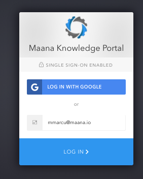
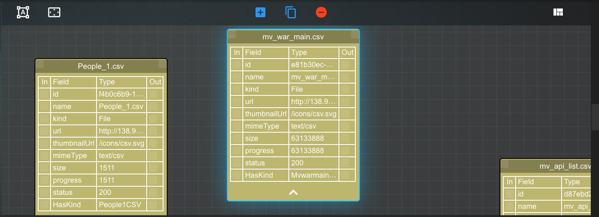
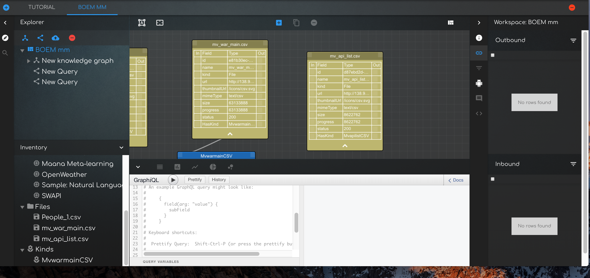
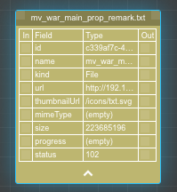
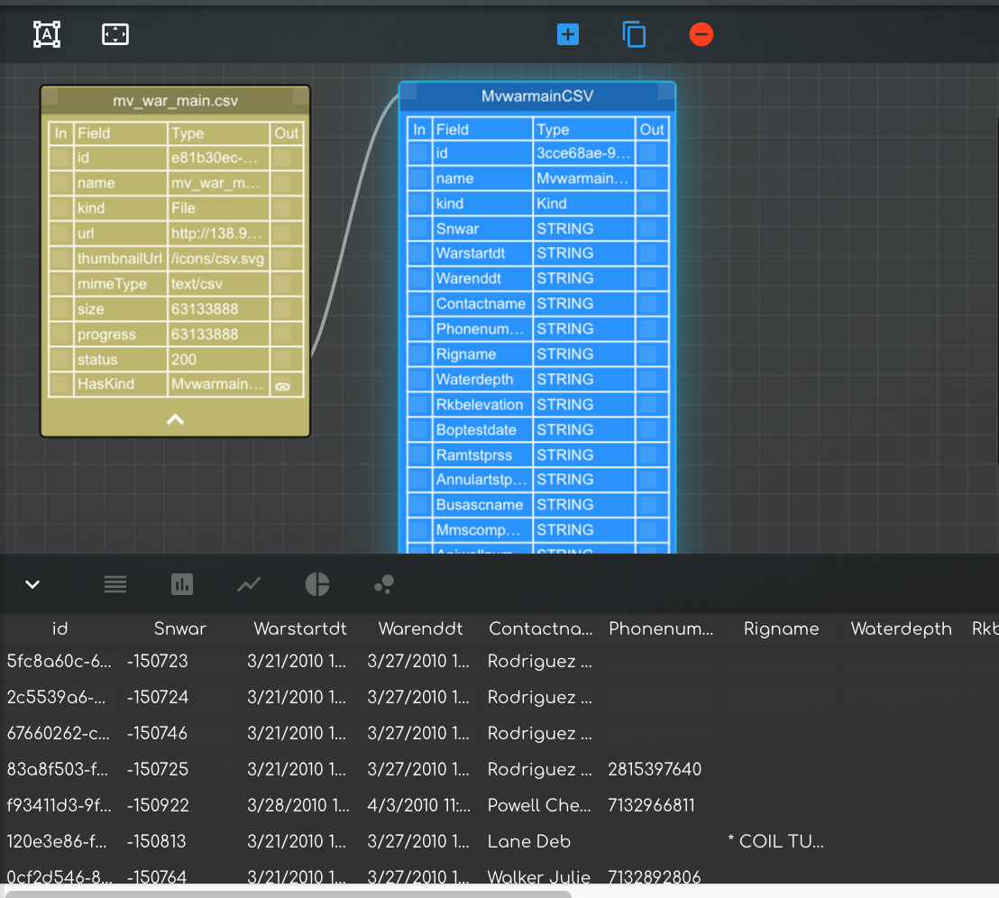
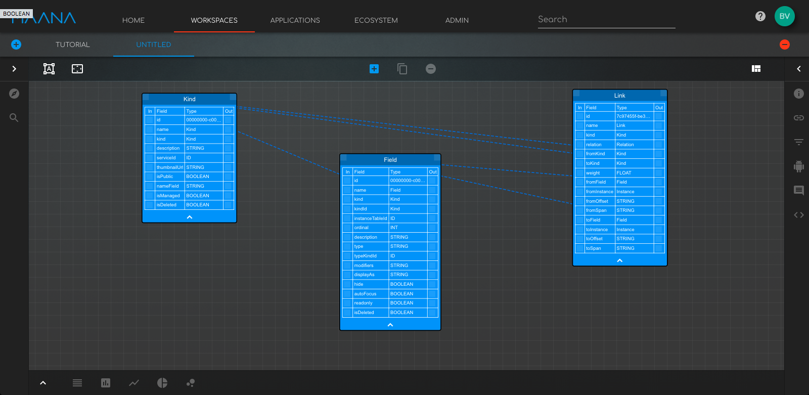
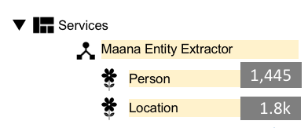

# Analyst

## Analyst Guide

This guide helps Analysts learn how to use the MAANA Knowledge Portal to create and explore knowledge graphs.

### What is Maana

In 2013 Maana invented a new way to represent industrial knowledge mathematically, using the Maana Patented Computational Knowledge Graph™. This unique technology enables industrial companies to encode human expertise and data from across silos into digital knowledge to help employees make better and faster decisions. The Maana Computational Knowledge Graph™ is a network of models that optimize specific operations and decisions flows by providing recommendations through AI-Driven Applications into those operations. This unique technology eliminates the need to move data and enables creation of thousands of models at scale, through the re-usability of models across the enterprise.

Note: Used content from [What is MAANA doc provide by Azita Feb 15, 2018](https://maanainc.box.com/s/ipm73olgc4xfdj6r8vcm2uxgloxzfzyz).

### Why Maana

The core of the Maana Knowledge Platform™ is its patented Computational Knowledge Graph™. The Maana Knowledge Graph is unique in several ways:

1. Unlike traditional “semantic” systems, the Knowledge Graph does not rely exclusively on ontologies and description logics. Instead, the Knowledge Graph separates the structure of data from the content itself. This separation enables a fluidity of modeling, allowing data from any source and in any format to be seamlessly integrated, modeled, searched, analyzed, operationalized and re-purposed.
2. The data remains at the source and only the most relevant data in the context of what is being optimized is indexed and brought into the graph.
3. Each resulting model is a unique combination of three key components – subject matter expertise, relevant data from silos, and the right algorithm – all of which are instrumental in optimizing assets and decision flows.
4. The Maana Computational Knowledge Graph is also dynamic. Nodes, which represent concepts in Maana’s graph are not static containers; they are computational vessels that allow for algorithms to be stored and executed. These algorithms could be as simple as pulling in new data from an external source, to as complicated as classification of documents through machine learning. As data is updated in real-time at the source, so are the nodes and the computational models that act on that data. This allows for far more complex relationships to be modeled, and facilitates the ability of the graph to understand the connections between concepts, rather than just strings in data. Ultimately this is used for optimizing decisions or operations.
5. Reusable Models

The flexibility of the Maana Knowledge Graph enables groups across the organization to leverage and build-upon models created by other groups, dramatically accelerating the speed at which models are created throughout the organization. These models are dynamic, and once operationalized into line-of-business applications, they learn and adapt based on the user’s behaviors and provide continuous intelligence for day-to-day operations.

The Maana Computational Knowledge Graph™ at the core of the platform is a network of models that are built using machine learning techniques and artificial intelligence that power AI-Driven Applications used to digitize decision support and operations.

It allows the knowledge of the business to be incrementally captured and grown, becoming more sophisticated as more projects are developed using it.

The MAANA knowledge platform offers a new way to get more out of machine learning and artificial intelligence projects and is the fastest way to digitize your business.

## 2 Log in/out to Maana

Go to the web address provided by IT admin.

The user can login using one of the 2 methods described below:

o Type user’s email address \(if single sign-on \(SSO\) is enabled by IT\) and click “Log in”

o Log in with a Google identity

Once logged in, the user can

· add/change info on his profile \(i.e name, add a picture, email address, etc\)

· choose between a Light or Dark portal theme

· Log out

To log out, go to the top right section of the Maana screen, click on the Profile icon and select the Log out option

## 3 MAANA Personal Dashboard \(Home Tab\)

The home screen of the MAANA portal has a few sections designed to help the user get faster to the activities that he/she is targeting.

Example of the Home Screen / Dashboard

### 3.1 Recent items

The recent items section is populated automatically by the system with the most recent items that the Business Analyst interacted with.

### 3.2 Favorite items

Favorite items section is populated with items that the Business Analyst marked as “Favorite” in the Context Panel area of the workspace \(insert hype link to . See  to learn how to make an item as Favorite.

The items that can be added to the Favorites list can be raw data kinds, kinddb, others… \(exhaustive list tbd\)

### 3.3

· what can i add to my Favorites and how do I do it?

· can i edit my Favorites list and delete favs from there?

### 3.4 Activity Feed

· what goes in the activity feed?

· any catalogue additions? what is considered a catalogue addition?

· kind additions to the KGs the user has access within a namespace.

· are there any settings I can change as user? need a way to make the activity feed relevant for my role.

## 4 Workspaces

### 4.1 What is a workspace

A workspace is a dedicated place within the MAANA portal where a user can build, visualize and explore computational knowledge graph.

The Maana portal home page features a tab called “Workspaces”, where the user can find:

· “My Workspaces” – workspaces that he/she created previously

· “Shared Workspaces” – workspaces that multiple users share

· “Workspace Templates” – can be used to create a new workspace from an existing template

Example of workspace

### 4.2 Shared workspaces

Once a workspace is created it will automatically be saved and will appear under “My workspaces” in the “Workspaces” tab. The user can share the workspace only with other users within the same tenant.

To share a workspace \(proposal\):

· Right-click on the workspace name and select the “Sharing…” option.

· Type the email addresses of the users you would like to add and then click “Share”

To remove a user from a shared workspace:

· Right-click on the workspace name and select the “Sharing…” option.

· Type the email addresses of the users you would like to remove from sharing and click “Remove Sharing”

### 4.3 Workspace Templates

Note: this is a proposal. Workspace templates not implemented yet.

Using workspace templates can speed up building knowledge solutions as they may come with ready built knowledge graphs, kinds, micro-services, etc.

To create a workspace template:

· Go to “My workspaces” in the “Workspaces” tab

· Right click on a workspace and select “Make Template“

· Click Yes on the confirmation message that appears

The newly created workspace template will appear in the Templates section. You can further share the template with other users within the same tenant by right-clicking on a template, selecting the “Sharing…“ option and adding the users you want the template to be shared with.

### 4.4 How to create/delete a workspace

To create a new workspace:

· Click on the “Workspaces” tab at the top of the Maana portal

· Click on the “+” on the top right of the new menu ribbon that appears. A new workspace with the name “Untitled” is created.

· To rename the newly created workspace edit the “Name” field in the Context Panel appearing on the right side of the screen, then scroll down to the bottom of the Context Panel and click the Save icon \(\).

To delete a workspace:

· The user can only delete workspaces that he/she created.

· Click on the “Workspaces” tab at the top of the Maana portal

· Right click on the workspace you wish to delete and select the “Delete” option

· The system will display a message asking for confirmation. Click “Yes” to confirm deletion.

**Caution**: deleting a workspace may impact applications, services and users connected to it. Contact your Maana platform admin or Maana customer support to understand the impact before deleting workspaces. The Maana platform admin can also delete a workspace following a request from end-user.

### 4.5 How to open/close an existing workspace

To open an existing workspace:

· Go to “Workspaces” tab in the top horizontal menu of and click on a workspace from My Workspaces, a shared workspace from the Shared Workspaces group, or a template from the Workspace Templates group.

Note: The secondary ribbon menu in the under the WORKSPACES tab shows the workspaces that are currently open. Clicking on any of the names will take the user to the respective workspace.

To close an existing workspace:

· Got the “Workspaces” tab in the top horizontal menu of and click on a workspace name in the secondary horizontal menu to select it, then click on the minus sign \(insert \) to the right of the list of workspace names.

### 4.6 Working within a workspace

The workspace features several areas with specific functionality that enables the user to create, manage, visualize and explore Knowledge Graphs and their components

#### 4.6.1 Explorer Panel

#### 4.6.2

The Explorer Panel allows the user to

· Create/clone a new Knowledge Graph

· Query a Knowledge Graph

· Upload a file or a group of files to create or enhance a knowledge graph

· Create a new Query

#### 4.6.3

#### 4.6.4 The Canvas

The Canvas enables the user to

· Drag and Drop files to create/enhance a knowledge graph

· Create/Delete kinds

· Curate existing kinds and the connections between them.

· Visualize and manually explore the Knowledge Graph

Canvas example.

#### 4.6.5 The Context Panel

The Context Panel has a few tabs enables the user to

· Information Tab \(\) -

o Modify Kinds and their properties

o Delete or remove Kinds from the Knowledge Graph

· Relations Tab \(\) – used to create relations between Kinds or entities within Kinds

· Text mining tab \(Doc Assist®\)  - Used for document classification.

· Filtering tab - ???

· Other tab- ???

#### 4.6.6

#### 4.6.7

#### 4.6.8

#### 4.6.9 The Inventory Panel

The Inventory Panel contains an inventory of micro services and files, kinds used in the workspace.

#### 4.6.10

#### 4.6.11 The Visualization Panel

#### 4.6.12

The Visualization Panel allows the user to visualize kinds and data associated with those kinds like instances, entities and values.

Raw Data kinds can be explored quickly using the visualization panel as each entity detected in the data file can be filtered using a “search as you type” capability

Note Marius: what about interpreted kinds? Do we still have the same filtering capability ? at some point?

The visualization panel can also be used to query a knowledge graph using GraphQL.

## 5 Platform capabilities

### 5.1 What is a Computational Knowledge Graph

The Maana Computational Knowledge Graph™ \(CKG\) is a network of models that optimize specific operations and decisions flows by providing recommendations through AI-Driven Applications into those operations. This unique technology eliminates the need to move data and enables creation of thousands of models at scale, through the re-usability of models across the enterprise.

An example of a CKG is a knowledge graph containing a networks of models describing the oil wells dug in the Gulf of Mexico during the last 50 years, including companies, people, equipment and activities involved, etc.

### 5.2 Key components of a CKG

Before creating a working CKG, it is useful to gain a basic understanding of a few notions that will help the user make most out of the MAANA portal experience.

Term

What is it?

Example

**Kinds**

Kinds are concepts.

Examples: People, Ships, Oil Wells, Invoices

**Fields/ Entities**

Entities are properties within a certain concepts

Examples of entities related to the People concept: age, sex, height, weight, etc.do we need this?

**Instances**

A particular set of values for entities within a concept.

Example of an instance: Paul, 40yrs old, male, 6', 180poundsExamples of entities related to the People concept: age, sex, height, weight, etc.

**Values**

A particular size, measure, number of an entity

Example of a value: 40Example of an instance: Paul, 40yrs old, male, 6', 180pounds

**Relations**

Connections /dependencies that can be established between fields belonging to different Kinds

Example: A Kind describing an oil well may contain a field of type String showing the name of the company operating that well. That field has a relation with the Kind containing Company Names

**Microservice / Bot**

· Microservices are processes that communicate with each other over a network in order to fulfill a goal using technology-agnostic protocols such as HTTP.

·

· They are organized around capabilities, e.g., user interface front-end, recommendation, logistics, billing, etc.

Microservices can emit events \(act as publishers\) which trigger automatic action\(s\) from other services \(acting as subscribers\) that react to those events.

Microservices are small in size, independently deployable and easy to replace.

.

Examples:

**io.maana.nlp** **service category**

Named entity recognition \(NER\) microservice

Doc classification

**io.maana\*\***.miner\*\*

Field classifier

**String**

**String** is any arbitrary length character sequence and is the most generic representation \(i.e. it has little meaning\).

·

**Knowledge Accelerator Tip**: check out our short Tutorial \(link to Tutorial doc\) with a specific, dataset-driven example on how you can create and explore a CKG. It will help you move much faster when you will create the first CKG from your own data!

### 5.3 Loading structured data into MAANA

To load structured data into Maana:

1. Create or select the workspace where you want to load data. Go to “Workspaces” Tab and either create a workspace or open a Shared Workspace/Template \( see 4.4 and/or 4.5 for more details if needed\).
2. Click the “upload file” button then select the file\(s\) you would like to add. You can also drag and drop files into the Canvas area to upload them into the current workspace. The platform currently supports the CSV file format, with more file types to be supported in the near future.

The uploading file\(s\) will appear on the canvas while a “Progress” indicator in the explorer tab shows that the file is being processed.

Following the completion of the upload process, the system will generate:

1. **Raw Data Kind\(s\)** – data kind representing files that were uploaded into Maana and their corresponding metadata.

Example of Raw Data Kind

1. **Interpreted Kind\(s\)–** kinds generated from the Raw Data Kind following parsing by Maana bots/microservices.

Loading data into a Raw Data Kind triggers automatic parsing by Maana bots, resulting in the creation of o Interpreted Kind and possibly other subsequent kinds \(People Names, Company, etc\) and connections between them, including:

· Field classifications: interpretations of individual fields and their values against known Kinds and instances \(e.g., People, Places, Organizations, Categorical\). For example the field classifier bot can suggest that an entity called “Company name” is of type “Company”, where Company is a known kind describing companies doing business in the US\).

· Entity extraction: analysis of comments, descriptions, or whole documents to identify mentions of entities, values, and facts

The interpreted kinds have a schemas that includes entities that make up that kind and their suggested field types, which can be detected by Maanaa field classifier microservice as generic field types \( ie String, Integer, etc\) or as kind types

Example: Interpreted Kind appears in blue, with sample instances showing in the visualization tab.

1. Relations between kinds - Maana suggested relations and/or dependencies within the associative network. The Business Analyst can review and validate them as part of the kind visualization and curation process.

Maana also offers the option to load multiple files via CLI. See section “5.9 CLI capabilities” for instructions.

### 5.4 Loading unstructured data into MAANA

The user can load unstructured data files into MAANA following the same process as for structured data:

1. Create or select the workspace where you want to load data. Go to “Workspaces” Tab and either create a workspace or open a Shared Workspace/Template \( see 4.4 and/or 4.5 for more details if needed\)
2. Click the “Upload file” button, select the desired file\(s\). You can also drag and drop files into the Canvas area to upload them into the current workspace. The platform currently supports the TXT and PDF text file formats, with additional file types to be supported in the near future.

However, when unstructured data files are loaded, there are additional bots/microservices that mine the data:

· Entity extraction: analysis of comments, descriptions, or whole documents to identify mentions of entities, values, and facts

The extracted entities will appear in the Inventory Tab, under the MAANA Entity Extractor service together with information how many instances of such entities were identified. The Business Analyst can drag one or all of the extracted entities to the canvas making them Kinds within the Knowledge Graph.

· Text classification: classification of comments, descriptions, or whole documents into preferred groups \(e.g. Comment problem types - Stuck pipe, Waiting on weather, etc. or document types - AFE report or Lease agreement\) – not available yet in UI.

### 5.5 Create, Delete or Rename a Kind

tba

### 5.6 Visualize kinds

### 5.7

Maana Kinds appear in 2 different shapes within the CKG canvas: Compact and Expanded

**Compact** **Representation** of an interpreted kind

The Compact representation of a kind includes the following elements:

· Kind name

· IN – relations connector at the kind level - shows incoming relations into the kind.

Example: IN-relation connector at the kind level.

· OUT- relations connector at the kind level - shows outgoing relations / dependencies TO other kinds

Example: OUT-relation connector at the kind level.

· Down-arrow – clicking on the down arrow changes the representation of the kind from Compact mode to the Expanded mode.

Expanded Representation–

The Expaded representation of a kind includes the following elements:

· Kind name

· IN – relations connector at the kind level - shows incoming relations into the kind.

· OUT- relations connector at the kind level - shows outgoing relations / dependencies TO other kinds

· List of entities within that kind.

· IN – relations connector at the entity level - shows incoming relations into the kind or entities within those kinds.

· 

· OUT- relations connector at the entity level - shows outgoing relations / dependencies TO other kinds or entities within those kinds

· Up-arrow – clicking on the up arrow changes the representation of the kind from Expanded mode to the Compact mode.

The user can cycle between the 2 different representations of the kind using the arrow at the bottom of the arrow. The way the kind is presented in the canvas space does not affect its functionality.

To visualize a kind, you need to bring in in focus first. That can be done by

· clicking on the kind in the canvas space

· selecting the kind from the list in the Explorer panel or the Inventory panel

In the bottom panel under the canvas, the user can

· preview the kind

· view a summary of a

While building or querying graphs, as a user, I need to have the ability to visualize its components \(Kinds, Queries, Files\) at all times. Information can of course be represented in many forms. Generally, the expectation is for the platform to automatically present the selected source in the most relevant visualization format.

Other requirements:

· Ability to preview data

· Ability to view entire data source

· Ability to apply visually interactive filters \(especially for the query graph\)

· Ability to visualize/interact with geo coordinate data via map visualizations

· Ability to visualize/curate entities extracted via the entity extraction service

· Ability to visualize/curate classification labels provided via the text classification service

Source: confluence story.

### 5.8 Curate Kinds

### 5.9

As a best practice, once an initial CKG was created from one or more uploaded files, we recommend that the Business Analyst follows a curation process to visualize and validate the kinds and the suggested relations among them to identify and correct any unintended errors that would otherwise propagate downstream and negatively impact decision-making.

We recommend that the use should do a quick inspection of each of the Maana-generated interpreted kinds to:

· Rename the kind for ease-of-use

· Validate/modify the field classifications suggested by the Maana bots

· Validate/modify suggested relations between kinds or between entities within a kind.

As a user, I want to be able to view the results of the entity extractor bot aka extracted entities for the following purposes:

· get a high level, summarized view of the results using the appropriate viz

· be able to click on the relevant Kind and see extracted results in the context of the selected Kind

· workspace 1 - running entity extraction on K: text remark produces instances in K: Person, K: Org and K: Location

· within ws 1 or create workspace 2 - running entity extraction on K: text remark\_2 produces additional instances in K: Person, K: Org and K: Location

· i want to see instances in K: Person, K: Org and K: Location filtered based on the source Kind\(s\) selected

· be able to remove or change labels as needed

· be able to look at the instances of a Kind and know which ones are sourced from files/documents vs classifier generated

source: [https://confluence.corp.maana.io/display/RD/Use+Case+07%3A+Curate+Extracted+Entities](https://confluence.corp.maana.io/display/RD/Use+Case+07%3A+Curate+Extracted+Entities)

### 5.10 Explore the knowledge graph

### 5.11 Query the knowledge graph using GraphQL

### 5.12 Using the context panel?!

### 5.13 Command Line capabilities

## 6 Using knowledge applications

## 7 Maana catalogue

### 7.1 Models

### 7.2 Bots

### 7.3 Reasoners

### 7.4 Visualizations

### 7.5 Assistants

### 7.6 Applications

## 8 Administrator Dashboard

The admin dashboard is used by the IT admin or designated superuser to:

· Manage namespaces

· Manage the Maana catalogue

## 9 Troubleshooting

## 10 Technical support

## 11 Glossary

